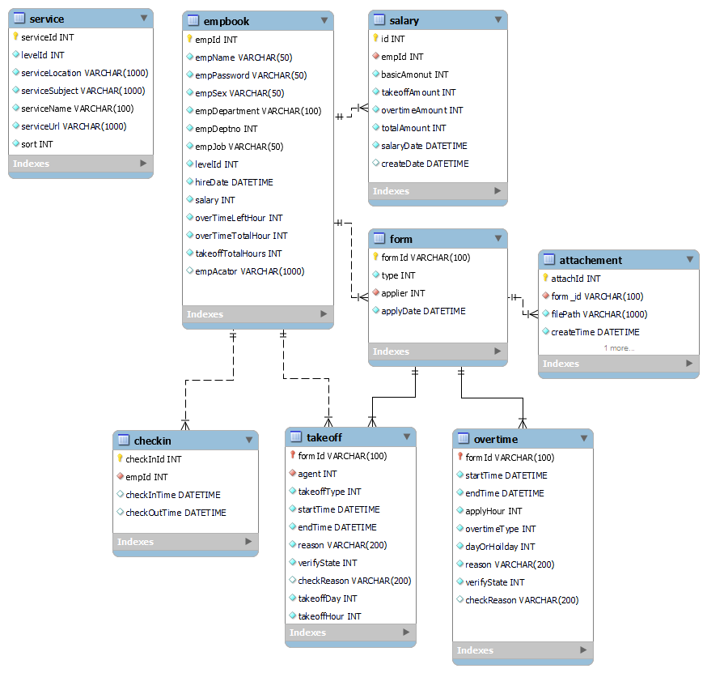

## 專案介紹
員工管理考勤系統(現正進行中 尚未完成)
## 技術棧
### Backend
* JAVA
* MySQL
* SpringMVC

### Frontend
* HTML
* JavaScript
* Bootstraps

## 功能與操作示範
* 登入與登出
* 打卡
* 請假申請&查詢
* 加班申請&查詢
* 主管帳號
  *簽核
  *考勤
*薪資計算 

## ER圖

